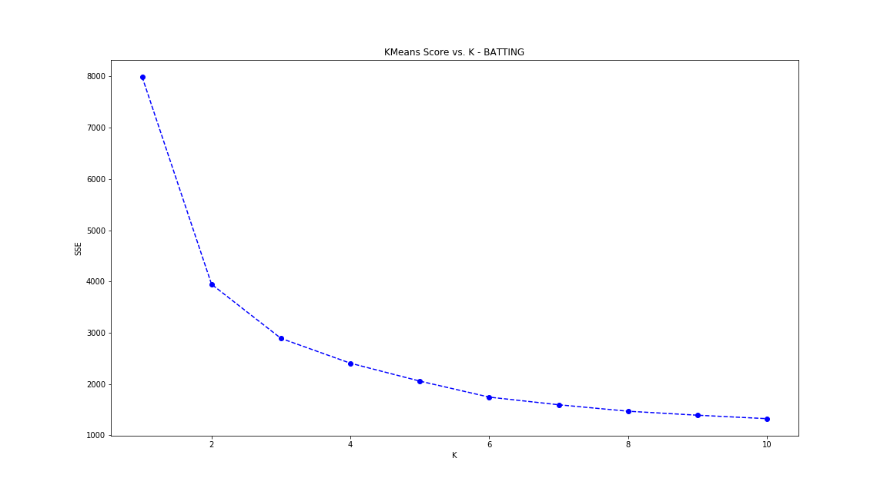
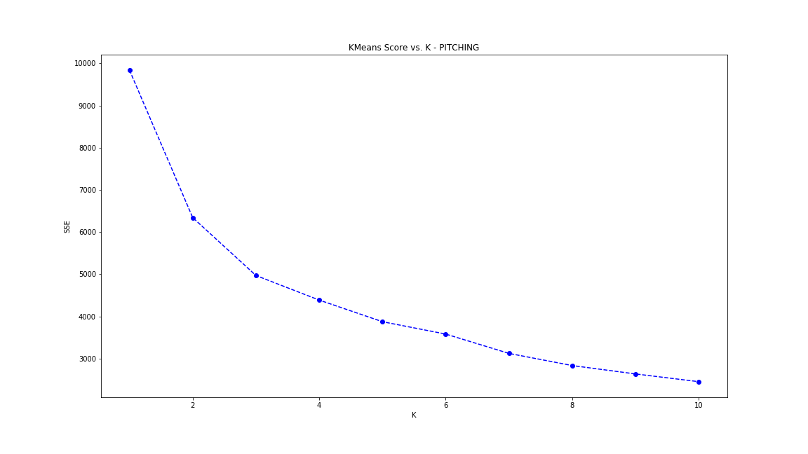

# MiLB_Sabermetrics

## Background

I decided to do this project because I applied to a Analytics Developer position for the Toronto MLB Blue Jays team. When I read the job description, the first thing I thought of was Jonah Hill's character in the movie Moneyball....and thought:

Full Disclaimer: I am not what one would call a baseball fan. I don't even know the rules very well. But what I do appreciate about baseball, is sabermetrics. Ever since Henry Chadwick created baseball from cricket he set a precedent for data collection....and this was all done way back during the turn of the 20th century. So out of any sport.....baseball is on a whole other level in terms of data analytics.

So the job relates to baseball operations and player evaluations. I wanted to build an interactive application for player recruitment purposes. The first thing I googled was who are players most likely to get recruited into MLB. Go figure....its MiLB. So my plan was to scrap [MiLB stats](http://www.milb.com/milb/stats/) for player data, cluster players based on sabermetric features using SciKit's KMeans Clustering algorithim, and then create an interactive application to visualize the data.

## Scrape

Refer to Scrape.ipynb.

I decided to keep the scope small, and just scrap all the Triple-A teams in the international league (total of 14 teams, around 500 players). Each team had its own url, where there was a batting table and pitching table that needed to be scraped. Each team page was rendered with javascript, so before scraping with Beautiful Soup, I used chromedriver and splinter to render the html first. This was a little time consuming (10-15 sec per team url), but only had to be done once. At the end of the scrape, I had 2 dataframes: one for batting players, and one for pithing players. I outputted the data to csvs for the next process in the pipeline. 

## KMeans Clustering

Refer to KMeans.ipynb

I had to do some minor data cleaning (e.g. get rid of nonsensical values and cast from string to float). Before inputting data into the KMeans model, I also had to get rid of features that added no value (e.g. string columns such as Name, Team, POS, and columns such as player id). 

Then I had to standardize the data, to ensure that features with large variance did not over dominate in importance during clustering. I used SciKit's StandardScaler method. 

The next step, was figuring out the value of k (number of clusters) to set to my model. For batting data I had 17 features, and for pitching data I had 19 features. I used the Elbow method or a Scree plot to correlate value of K against KMeans-score (average distance of point to assigned centroid). 

The following is my Scree Plot for batting data:
 

The following is my Scree Plot for pitching data:

Based on Scree plots above, I picked 4 clusters for both batting and pitching data as that is where it visually looked like an inflection point.

Then it was just a matter of fitting the KMeans model (with k=4) and predicting a cluster_label for each player. The KMeans algorithim invovles setting a random starting point for k number of centroids and iterating until the average distance of points to a given centroid is minimized. The random starting points of the centroids matter in terms of the final clusters produced by the model. Because of this, KMeans must run many times to find that local minima. I left it at default to run 300 times for both the batting model and the pitching model. 

Last but not least, I jsonified data for the final process (web dasboard).

## Plotly Visualization 

I made a quick interactive  web visualization with Plotly. There are 2 plot sections: one for batting data, and one for pitching data. For batting data there are 17 features and for pitching data there are 19 features. The idea is to lef the user pick a feature for the y-axis and a feature for the x-axis to do a bivariate feature comparison through a scatter plot. Each point represents a player, and if the user hovers over the point, a tool tip appears to give the Name, Position, team, x value, and y value. The points are color-coded by player cluster, so players colored the same were clustered together given all 17 or 19 features depending on batting or pitching, respectively. If the user picks the same feature for the x-axis and y-axis, then the plot switches to a histogram to show the number of players that fall into a certain range for the given feature. 

 

 

